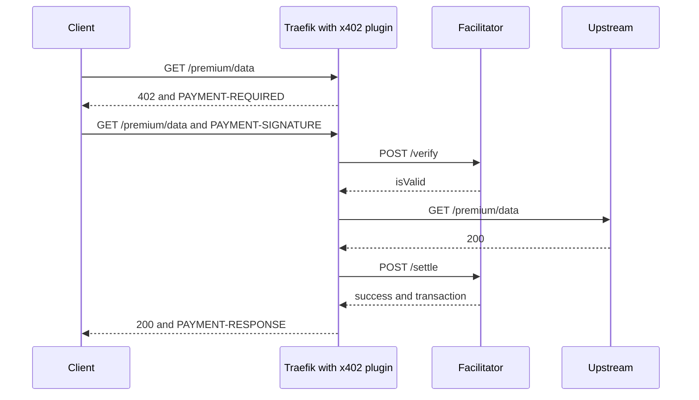

# traefik-x402

A Traefik middleware plugin that charges for HTTP resources with the
[x402 v2](https://github.com/coinbase/x402/blob/main/specs/x402-specification-v2.md)
payment protocol.

You choose the URLs. A client that requests one of them without a valid payment
receives `402 Payment Required` with the price. The client pays and retries. The
plugin verifies and settles the payment through an x402 facilitator, then serves
the response.

- Protect exact URLs, prefixes, suffixes, or any mix of them.
- Offer several assets for one URL: USDC, any other token your facilitator
  supports, on any network it supports.
- Charge only for successful responses. In the default mode, an upstream status
  of 400 or above is never settled.
- Sign facilitator calls itself: static headers, secrets from environment
  variables or files, and Coinbase Developer Platform (CDP) API-key JWTs.
- Check the facilitator's `/supported` list at start-up.
- Standard library only. No dependencies, no vendor directory.

Contents: [How it works](#how-it-works) ·
[Quick start](#quick-start) · [Choose URLs](#choose-which-urls-to-protect) ·
[Assets](#offer-several-assets-for-one-url) · [Facilitator](#facilitator) ·
[Settlement](#settlement-timing) · [Limits](#streaming-and-websocket) ·
[Reference](#configuration-reference) · [Compliance](#x402-v2-compliance) ·
[Performance](#performance) · [Development](#development)

## How it works



The plugin is the x402 *resource server*. It never touches a wallet or a
blockchain. The facilitator does that.

## Quick start

Enable the plugin in the Traefik static configuration:

```yaml
experimental:
  plugins:
    x402:
      moduleName: github.com/lukaszraczylo/traefik-x402
      version: v0.1.0   # use the latest release tag
```

Define the middleware in a dynamic configuration. The values below are the Base
Sepolia USDC example from the x402 specification:

```yaml
http:
  middlewares:
    pay:
      plugin:
        x402:
          facilitatorURL: https://x402.org/facilitator
          accepts:
            - network: eip155:84532          # Base Sepolia, a CAIP-2 identifier
              amount: "10000"                # atomic units: 0.01 USDC
              asset: "0x036CbD53842c5426634e7929541eC2318f3dCF7e"
              payTo: "0x209693Bc6afc0C5328bA36FaF03C514EF312287C"
              extra: { name: USDC, version: "2" }
          exact:    [/report]
          prefixes: [/premium/]
          suffixes: [.pdf]
  routers:
    api:
      rule: Host(`api.example.com`)
      service: api
      middlewares: [pay]
```

An unpaid request to a protected URL returns this (captured from the unit
tests with two options on Base mainnet):

```http
HTTP/1.1 402 Payment Required
Content-Type: application/json
Cache-Control: no-store
Access-Control-Expose-Headers: PAYMENT-REQUIRED, PAYMENT-RESPONSE
PAYMENT-REQUIRED: eyJ4NDAyVmVyc2lvbiI6MiwiZXJyb3IiOiJQQVlNRU5ULVNJR05BVFVSRSBo...
```

The header holds base64 of this JSON. The response body holds the same JSON.

```json
{"x402Version":2,"error":"PAYMENT-SIGNATURE header is required",
 "resource":{"url":"https://api.example.com/premium/data","description":"Premium data","mimeType":"application/json"},
 "accepts":[
  {"scheme":"exact","network":"eip155:8453","amount":"10000","asset":"0x833589fCD6eDb6E08f4c7C32D4f71b54bdA02913","payTo":"0x209693Bc6afc0C5328bA36FaF03C514EF312287C","maxTimeoutSeconds":60,"extra":{"name":"USD Coin","version":"2"}},
  {"scheme":"exact","network":"eip155:8453","amount":"10000","asset":"0x60a3E35Cc302bFA44Cb288Bc5a4F316Fdb1adb42","payTo":"0x209693Bc6afc0C5328bA36FaF03C514EF312287C","maxTimeoutSeconds":60,"extra":{"name":"EURC","version":"2"}}]}
```

Use an [x402 client](https://github.com/coinbase/x402) to sign the payment and
send it in the `PAYMENT-SIGNATURE` header.

## Choose which URLs to protect

A rule selects a request when its path matches **any** entry of these lists:

| Field | Matches when the path | Example |
| --- | --- | --- |
| `exact` | equals the entry | `/report` matches `/report` |
| `prefixes` | starts with the entry | `/premium/` matches `/premium/a/b` |
| `suffixes` | ends with the entry | `.pdf` matches `/docs/manual.pdf` |

Entries in `exact` and `prefixes` must start with `/`. Matching is case-sensitive
unless you set `ignoreCase: true`. The plugin matches the percent-decoded path
without the query string (`matcher.go`). The `resource.url` in a `402` includes the query string.

The plugin tests the decoded path and its cleaned form (`path.Clean`). The path
`/free/../premium/x` is therefore still protected, even if your backend resolves
`..`. The path `/report/` matches `exact: [/report]` for the same reason.

The top-level `exact`, `prefixes`, `suffixes`, `methods`, `description` and
`mimeType` fields form one implicit rule. Use `rules` when different paths need
different prices. The plugin applies the first matching rule. The implicit rule
comes last.

```yaml
x402:
  facilitatorURL: https://x402.org/facilitator
  accepts: [ ... ]              # default price list
  prefixes: [/api/]             # implicit rule, default price
  rules:
    - name: quarterly-report
      exact: [/api/report]
      description: Quarterly report
      mimeType: application/pdf
      methods: [GET]            # default: every method except OPTIONS
      settlement: before        # optional override of the global mode
      accepts:                  # replaces the default list for this rule
        - network: eip155:8453
          amount: "5000000"
          asset: "0x833589fCD6eDb6E08f4c7C32D4f71b54bdA02913"
          payTo: "0x209693Bc6afc0C5328bA36FaF03C514EF312287C"
          extra: { name: USD Coin, version: "2" }
```

CORS preflight requests (`OPTIONS`) are never charged unless a rule lists
`OPTIONS` in `methods`.

## Offer several assets for one URL

Each entry of `accepts` is one payment option. The client picks one and echoes it
in `PAYMENT-SIGNATURE`. The plugin accepts the payment only if the echoed option
equals one of yours exactly, including `extra`.

```yaml
accepts:
  - network: eip155:8453                  # USDC on Base
    amount: "10000"                       # 0.01 USDC: 6 decimals
    asset: "0x833589fCD6eDb6E08f4c7C32D4f71b54bdA02913"
    payTo: "0x209693Bc6afc0C5328bA36FaF03C514EF312287C"
    extra: { name: USD Coin, version: "2" }
  - network: eip155:8453                  # EURC on Base
    amount: "10000"                       # 0.01 EURC: 6 decimals
    asset: "0x60a3E35Cc302bFA44Cb288Bc5a4F316Fdb1adb42"
    payTo: "0x209693Bc6afc0C5328bA36FaF03C514EF312287C"
    extra: { name: EURC, version: "2" }
  - network: solana:5eykt4UsFv8P8NJdTREpY1vzqKqZKvdp   # USDC on Solana
    amount: "10000"
    asset: EPjFWdd5AufqSSqeM2qN1xzybapC8G4wEGGkZwyTDt1v
    payTo: "<your Solana address>"
```

The token values for Base were read from the chain on 2026-10-03: `name()`,
`version()` and `decimals()` of both contracts, and a successful
`authorizationState` call on EURC, which shows EIP-3009 support. The Solana
network and USDC mint come from the x402 SVM specification. Check your own
values the same way before you go live.

- `amount` is a decimal string in the token's atomic units. Work it out from the
  token's `decimals()`. Tokens with different decimals need different amounts.
- `asset` is the token contract (EVM), the mint (Solana) or an ISO 4217 code, as the specification describes it. The plugin only requires a non-empty value.
- `extra` is scheme data. For an EIP-3009 token, set the EIP-712 domain `name`
  and `version` of the token contract. Values are strings.
- A token without EIP-3009 (for example DAI on Base: `authorizationState`
  reverts) needs the Permit2 method. The EVM specification selects it with
  `extra.assetTransferMethod: permit2`. Whether a facilitator offers it is the
  facilitator's decision. The plugin passes `extra` through and does not
  interpret it.
- `network` is a [CAIP-2](https://chainagnostic.org/CAIPs/caip-2) identifier. The
  plugin checks the shape, not the existence.
- `scheme` defaults to `exact`. `maxTimeoutSeconds` defaults to `60`.

For Solana the `exact` scheme needs `extra.feePayer`. With
`supportedCheck: strict` the plugin copies it from the facilitator's `/supported`
response when you set none.

## Facilitator

| Field | Default | Purpose |
| --- | --- | --- |
| `facilitatorURL` | required | Base URL. The plugin calls `/verify`, `/settle` and `/supported`. |
| `facilitatorTimeout` | `10s` | Timeout for each facilitator call. |
| `facilitatorHeaders` | none | Static request headers. |
| `facilitatorAuth` | none | Per-request credentials. See below. |
| `supportedCheck` | `warn` | `off`, `warn` or `strict`. See below. |
| `allowInsecureFacilitator` | `false` | Permits an `http://` URL. Use it for tests only. |

The plugin keeps up to 128 idle connections to the facilitator
(`facilitator.go`). It sends the client payload to the facilitator byte for byte,
so fields it does not know still arrive. The `paymentRequirements` field always
holds your configured option, never the client's copy.

### Keep secrets out of the configuration

Any value in `facilitatorHeaders` and the `keyID` and `keySecret` fields of
`facilitatorAuth` can be a reference:

- `env:NAME` reads the environment variable `NAME`.
- `file:/path` reads the file and trims whitespace. This fits Kubernetes secret
  mounts.

An empty variable or an unreadable file stops the plugin from starting. The
plugin reads references once, at start-up. Traefik reloads the plugin when the
dynamic configuration changes.

```yaml
facilitatorHeaders:
  Authorization: env:FACILITATOR_TOKEN   # the variable holds: Bearer abc123
```

### Sign requests for the CDP facilitator

The [CDP facilitator](https://docs.cdp.coinbase.com/x402/seller/facilitator)
authenticates each request with a short-lived JWT. Static headers cannot do
that, so the plugin signs the token itself:

```yaml
facilitatorURL: https://api.cdp.coinbase.com/platform/v2/x402
facilitatorAuth:
  type: cdp
  keyID: env:CDP_API_KEY_ID
  keySecret: file:/run/secrets/cdp_api_key_secret
```

The token follows the CDP API-key documentation
(<https://docs.cdp.coinbase.com/api-reference/v2/authentication>):

- Header: `alg`, `typ: JWT`, `kid` (the key ID) and a random `nonce`.
- Claims: `sub` (the key ID), `iss: cdp`, `aud: [cdp_service]`, `nbf`, `exp` and
  `uri`, which is `METHOD host/path` of the request.
- The token lives 120 seconds. The plugin caches one token for each `uri` and
  reuses it until 30 seconds before it expires.
- `keySecret` is either the base64 Ed25519 secret (64 bytes: seed and public key,
  or the 32-byte seed alone) and signs with `EdDSA`, or a P-256 EC private key in
  PEM form and signs with `ES256`. A secret pasted as one line with literal `\n`
  sequences works.

The unit tests verify the signatures with the matching public key. The end-to-end
test checks every facilitator call on a real Traefik. No test has called the CDP
service itself, because that needs a CDP account.

### Check what the facilitator supports

`supportedCheck` compares your options with the facilitator's `GET /supported`
response. An option is supported when a kind with `x402Version` 2 has the same
`scheme` and `network`.

| Value | Behaviour |
| --- | --- |
| `off` | No check. |
| `warn` (default) | Checks in the background after start-up. Logs unsupported options as warnings. A failed check logs a warning. The plugin keeps working. |
| `strict` | Checks before the plugin starts, with `facilitatorTimeout`. An unreachable facilitator or an unsupported option stops the plugin with an error. Adds the facilitator's `feePayer` to options that have none. |

Run against the public `https://x402.org/facilitator` on 2026-10-03, the strict
check passed for Base Sepolia (`eip155:84532`) and Solana devnet, filled the
Solana `feePayer`, and rejected Base mainnet (`eip155:8453`). That facilitator
lists test networks only. Run the same test: `go test -tags live -run Live .`

## Settlement timing

| `settlement` | Order | Upstream error | Best for |
| --- | --- | --- | --- |
| `after` (default) | verify, upstream, settle | not charged | normal APIs |
| `before` | verify, settle, upstream | charged | event streams |

In `after` mode the plugin settles when the upstream commits to a status below
400, before the first body byte reaches the client. The body then streams
without buffering. If settlement fails, the plugin discards the upstream response
and sends `402` with a `PAYMENT-RESPONSE` header that describes the failure. That
holds when the facilitator answers with `success: false`. If the `/settle` call
itself fails (unreachable, HTTP error without JSON, unparseable body), the plugin
sends `500` with `unexpected_settle_error` and no `PAYMENT-RESPONSE` header.

Set `settlement` per rule or globally. A rule value wins. A request with
`Accept: text/event-stream` always settles first.

### Streaming and WebSocket

Traefik runs plugins in the Yaegi interpreter. Yaegi hides the `Flusher` and
`Hijacker` interfaces of a wrapped response writer. We measured the effect on
Traefik v3.7: in `after` mode a server-sent event stream arrived only when the
upstream finished. That is why event streams settle first.

For the same reason the plugin does not support WebSocket on protected paths.
A request with an `Upgrade` header to a protected path receives `501` with the
reason `upgrade_not_supported`, before any payment step. The x402 HTTP transport
does not define a WebSocket flow. Upgrade requests to unprotected paths pass
through untouched. Route WebSocket traffic outside your rules.

## Replay protection

Between verification and settlement, one signed authorization could unlock many
concurrent requests. The blockchain stops a double spend, but you would serve the
extra requests for free. The replay guard closes that window. It rejects a
request that carries a payment already in use with `402` and the reason
`payment_already_used`.

- It is on by default. Set `replayGuard: false` to disable it.
- A payment that was never settled (upstream error, failed settlement) is
  released, so the client can retry.
- An entry lives for the largest `maxTimeoutSeconds` of the rule plus 60 seconds.
- The state is in memory and belongs to one Traefik instance. With several
  replicas, the chain and the facilitator are the shared guard.
- The guard has 16 shards of 8192 entries. A full shard lets requests through
  rather than blocking paying clients.

## Configuration reference

| Field | Default | Purpose |
| --- | --- | --- |
| `facilitatorURL` | required | Facilitator base URL. |
| `facilitatorTimeout` | `10s` | Facilitator call timeout. |
| `facilitatorHeaders` | none | Static facilitator headers. Values accept `env:` and `file:`. |
| `facilitatorAuth` | none | `type: cdp`, `keyID`, `keySecret`. |
| `allowInsecureFacilitator` | `false` | Allow an `http://` facilitator URL. |
| `supportedCheck` | `warn` | `off`, `warn` or `strict`. |
| `accepts` | none | Default payment options. A rule without its own `accepts` uses them. |
| `exact`, `prefixes`, `suffixes` | none | Selectors of the implicit rule. |
| `methods` | all but `OPTIONS` | Methods the implicit rule charges. |
| `description`, `mimeType` | none | `resource.description` and `resource.mimeType` of the implicit rule. |
| `rules` | none | List of rules. Each has the selectors `exact`, `prefixes`, `suffixes`, plus `methods`, `description`, `mimeType`, `accepts`, `settlement` and `name` (used in error messages). |
| `settlement` | `after` | `after` or `before`. |
| `replayGuard` | `true` | Reject a payment that is already in use. |
| `ignoreCase` | `false` | Case-insensitive path matching. |
| `payerHeader` | none | Upstream header that receives the payer address. The plugin removes any client value on every request. |
| `forwardPaymentHeader` | `false` | Forward `PAYMENT-SIGNATURE` to the upstream. |
| `resourceBaseURL` | derived | Fixes scheme and host in `resource.url`. Otherwise the plugin uses `X-Forwarded-Proto`, `X-Forwarded-Host` and `Host`. |
| `extensionsJSON` | none | JSON object added as `extensions` to each `PaymentRequired`. |

Each option in `accepts` has `network`, `amount`, `asset`, `payTo` (all required),
`scheme`, `maxTimeoutSeconds` and `extra`. The plugin validates the whole
configuration at start-up and returns an error that names the field or the rule.

Set `resourceBaseURL` unless Traefik overwrites `X-Forwarded-*` headers from
untrusted clients. Otherwise a client can influence the `resource.url` it gets
back. The plugin uses that value for no decision.

## x402 v2 compliance

The behaviour follows the core specification
(`specs/x402-specification-v2.md`) and the HTTP transport specification
(`specs/transports-v2/http.md`) in `coinbase/x402`, read on 2026-10-03.

| Requirement | Behaviour |
| --- | --- |
| `PaymentRequired` | `x402Version: 2`, `error`, `resource`, `accepts`, optional `extensions`. Sent as base64 in `PAYMENT-REQUIRED` and as the JSON body. |
| Unpaid request | `402` with the error `PAYMENT-SIGNATURE header is required`. |
| `PaymentPayload` | Read from `PAYMENT-SIGNATURE` as base64 JSON. Standard and URL-safe alphabets work, padded or not. |
| Requirement matching | The `accepted` object must equal one configured option, including `extra`. Otherwise `402` with `invalid_payment_requirements`. |
| Malformed payment | `400` with `invalid_payload` for bad base64, bad JSON, a missing `accepted` field, or a `PAYMENT-SIGNATURE` header over 64 KiB. `400` with `invalid_x402_version` when `x402Version` is not `2`. |
| Verification | `POST {facilitator}/verify` with `x402Version`, `paymentPayload`, `paymentRequirements`. |
| Invalid payment | `402`. The facilitator's `invalidReason` becomes `error`. |
| Settlement | `POST {facilitator}/settle` with the same body. |
| `SettlementResponse` | Relayed in `PAYMENT-RESPONSE` as the facilitator's JSON with whitespace removed, when the facilitator answers. |
| Settlement failure | `402` with `PAYMENT-RESPONSE` and `PAYMENT-REQUIRED`. |
| Facilitator unreachable or unparseable | `500` with `unexpected_verify_error` or `unexpected_settle_error`. |
| Networks | CAIP-2 identifiers, validated at start-up. |
| Extensions | Advertised through `extensionsJSON`. The client's echo goes to the facilitator untouched. |

Not part of this plugin: the facilitator service, discovery
(`/discovery/resources`) and client-side signing. The plugin does not convert
prices. You write each `amount` in atomic units.

## Performance

Measured with `go test -run '^$' -bench . -benchmem -count=3 .` on an Apple M4 Max
(darwin/arm64, Go 1.27.1). These runs use compiled code. Traefik runs the plugin
in Yaegi, which is slower. The ranges below cover three runs.

| Benchmark | Time | Allocations |
| --- | --- | --- |
| `BenchmarkUnprotectedPath`: request outside every rule | 33 ns | 0 |
| `BenchmarkFindRule`: 3 prefixes, 2 suffixes, 4 exact entries | 23 ns | 0 |
| `BenchmarkPaymentRequired`: build a `402` with two options | 0.80 to 0.83 µs | 15 |
| `BenchmarkDecodePayload`: base64 and JSON decode of a payment | 1.6 µs | 11 |
| `BenchmarkReplayGuardClaim`: claim and release | 50 ns | 0 |
| `BenchmarkPaidRequest`: verify, upstream and settle against a loopback facilitator | 74 to 76 µs | 223 |

`BenchmarkPaidRequest` includes the cost of the in-process facilitator and two
loopback HTTP calls. A real facilitator adds its network round trips, which
dominate.

Design choices behind the numbers:

- Rules compile at start-up. Exact paths use a map. Prefix and suffix scans
  allocate nothing.
- Each payment option is encoded to JSON once. A `402` concatenates bytes.
- The plugin sends the payload to the facilitator without re-encoding it.
- Settlement happens at the first response header, so paid bodies stream.
- The facilitator client reuses connections.

## Security notes

- The plugin removes `PAYMENT-SIGNATURE` before it forwards the request, unless
  you set `forwardPaymentHeader`. The upstream cannot reuse a pending
  authorization.
- The plugin rejects an `http://` facilitator URL unless you set
  `allowInsecureFacilitator`.
- The plugin never logs payment payloads.
- `payTo` comes from your configuration. The plugin never takes it from the
  client.
- Secrets can stay out of the configuration with `env:` and `file:` references.

## Development

```console
make test         # unit tests with the race detector
make cover        # coverage summary
make lint         # gofmt, vet, golangci-lint, fieldalignment, gosec, govulncheck
make bench        # benchmarks
make yaegi-check  # load the plugin in Yaegi like the Plugin Catalog does
make e2e          # run the plugin in a real Traefik container (needs docker)
go test -tags live -run Live .   # strict start-up against x402.org (needs network)
```

- Unit tests cover 97.4% of statements (`go test -cover .`).
- `tools/yaegi-check` loads the plugin in Yaegi v0.16.1, decodes the
  `.traefik.yml` test data, calls `New` across the reflect boundary, and drives
  payment flows, JWT signing and the `/supported` check through the interpreted
  handler.
- `integration` starts `traefik:v3.7` with the plugin as a local plugin. It uses
  a mock facilitator and a mock upstream on the host. The tests cover: `402` on
  exact, prefix and suffix rules; two assets; replay rejection; upstream errors;
  failed settlement; event streaming; WebSocket handling; strict `/supported`
  start-up; and signed facilitator calls.
- `.github/workflows` runs the shared Go pull-request checks with a 75% coverage
  threshold, the Yaegi harness and the end-to-end test. Pushes to `main` that
  change Go code run the shared release workflow, which computes the version
  from commit messages with `semver.yaml`.

The plugin follows the Yaegi rules from the Traefik catalog: no generic standard
library functions, no `atomic.Pointer`, and no tail-call returns in `New`.

## Licence

MIT.
